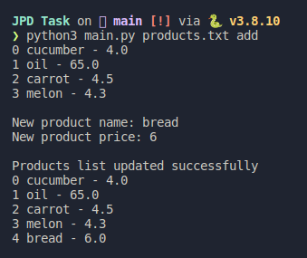

# JPD-Task
***
## :pencil: Instructions to use the application

### 1. Adding item to the product list
   ``` 
   python3 main.py products.txt add
   ```
   
### 2. Editing the item
```
python3 main.py products.txt edit
```


### 3. Deleting the item
```
python3 main.py products.txt delete
```


### 4. Calculating the total price
```
python3 main.py products.txt calc
```
